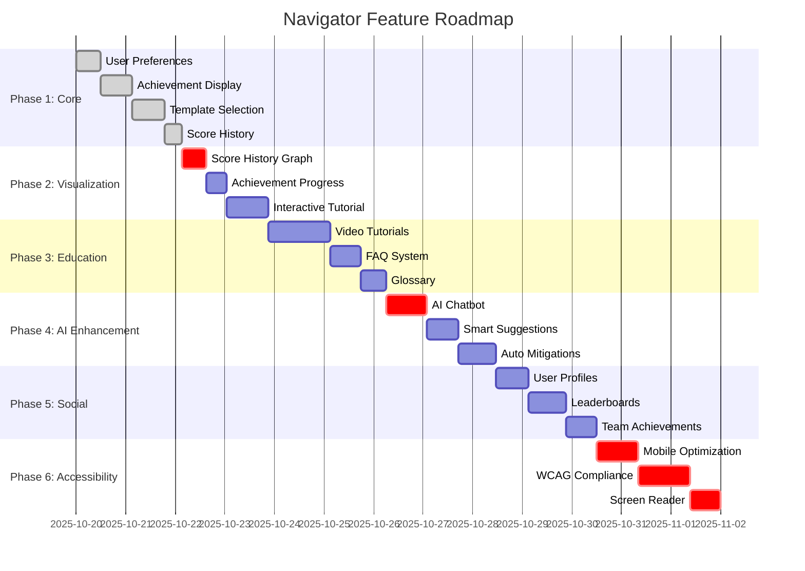
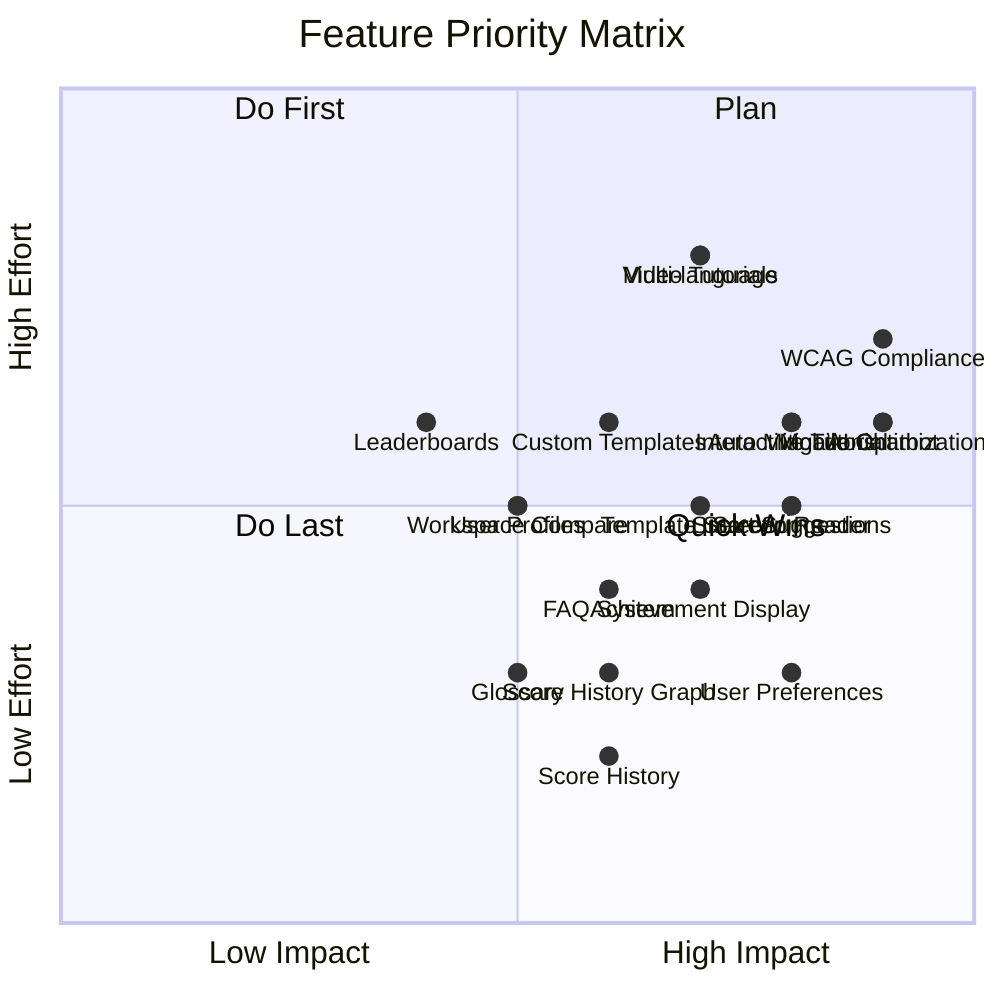
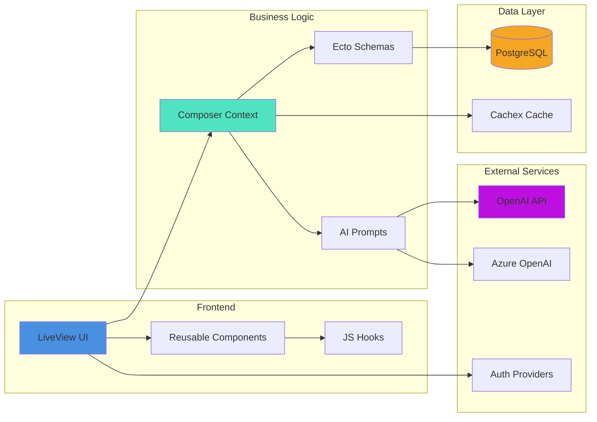
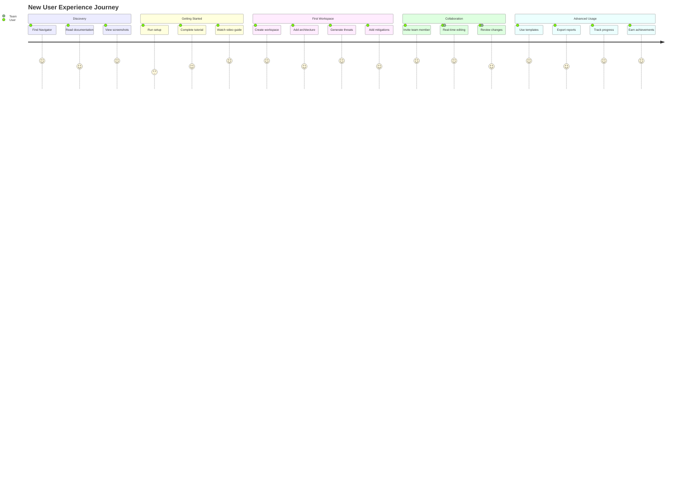
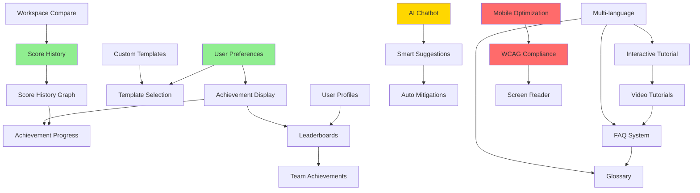
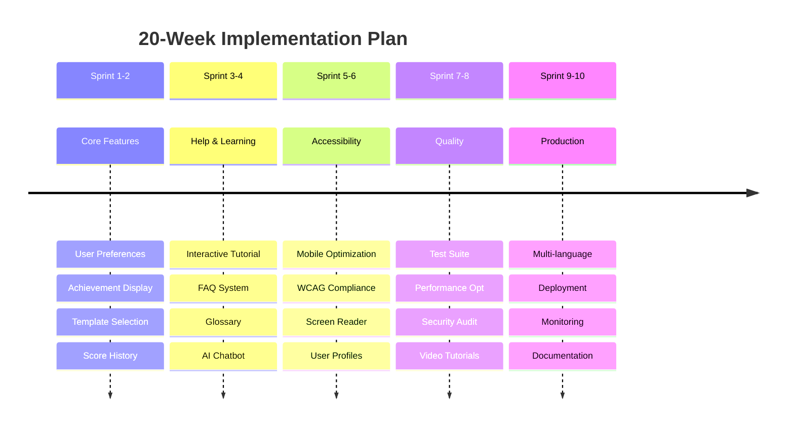
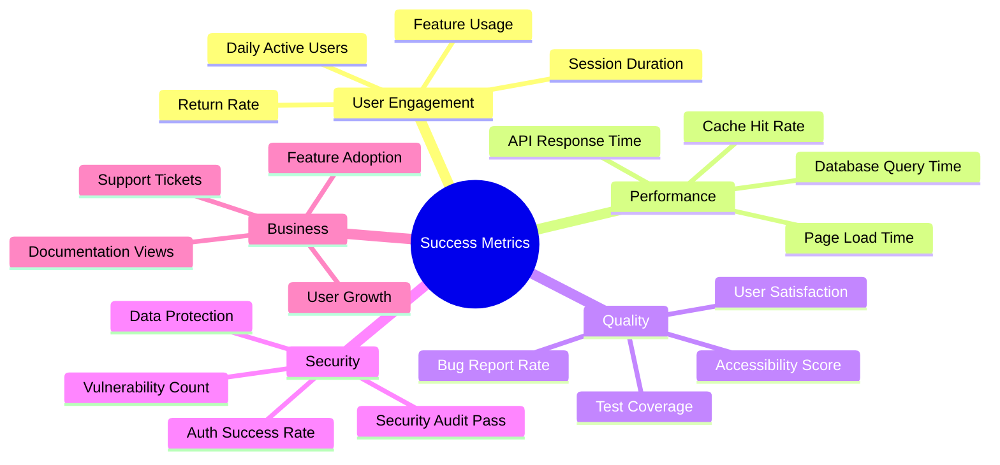
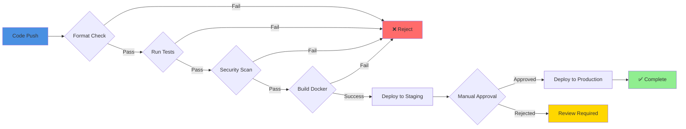

# Navigator Roadmap Visualization

This document provides visual representations of the Navigator roadmap.

## 📊 Implementation Timeline

## 🎯 Priority Matrix

## 📈 Phase Progress Tracker

```mermaid
graph TB
    subgraph Phase 1 - Core Functionality
        A1[User Preferences<br/>8-12h] --> A2[Achievement Display<br/>10-15h]
        A2 --> A3[Template Selection<br/>12-16h]
        A3 --> A4[Score History<br/>6-8h]
    end
    
    subgraph Phase 2 - Visualization
        B1[Score Graph<br/>10-12h] --> B2[Progress Viz<br/>8-10h]
        B2 --> B3[Tutorial<br/>16-20h]
    end
    
    subgraph Phase 3 - Education
        C1[Video Tutorials<br/>20-30h] --> C2[FAQ System<br/>12-15h]
        C2 --> C3[Glossary<br/>10-12h]
    end
    
    subgraph Phase 4 - AI Enhancement
        D1[AI Chatbot<br/>16-20h] --> D2[Smart Threats<br/>12-15h]
        D2 --> D3[Auto Mitigations<br/>14-18h]
    end
    
    subgraph Phase 5 - Social
        E1[User Profiles<br/>12-16h] --> E2[Leaderboards<br/>14-18h]
        E2 --> E3[Team Achievements<br/>12-15h]
    end
    
    subgraph Phase 6 - Accessibility
        F1[Mobile Opt<br/>16-20h] --> F2[WCAG AA<br/>20-25h]
        F2 --> F3[Screen Reader<br/>12-15h]
    end
    
    A4 --> B1
    B3 --> C1
    C3 --> D1
    D3 --> E1
    E3 --> F1
    
    style A1 fill:#90EE90
    style A2 fill:#90EE90
    style A3 fill:#90EE90
    style A4 fill:#90EE90
    style B1 fill:#FFD700
    style D1 fill:#FFD700
    style F1 fill:#FF6B6B
    style F2 fill:#FF6B6B
    style F3 fill:#FF6B6B
```

## 🏗️ System Architecture

## 🎭 User Journey Map

## 📊 Feature Dependencies

## 📅 Sprint Planning

## 🎯 Success Metrics

## 🔄 CI/CD Pipeline

---

## 📌 How to Use These Diagrams

### In GitHub
GitHub automatically renders Mermaid diagrams in Markdown files. Simply view this file on GitHub to see the interactive diagrams.

### In Documentation
Copy the Mermaid code blocks to include in other documentation files.

### In Presentations
Take screenshots of the rendered diagrams for presentations and reports.

### For Planning
Use these diagrams in planning meetings to visualize dependencies and timelines.

---

## 🔄 Updating These Diagrams

When features are completed:
1. Update the status in the gantt chart
2. Adjust dependencies in the dependency graph
3. Update the progress tracker colors
4. Reflect changes in the timeline

When priorities change:
1. Update the priority matrix positions
2. Adjust the timeline accordingly
3. Update dependencies as needed

---

*Generated: October 2025*
*Format: Mermaid.js*
